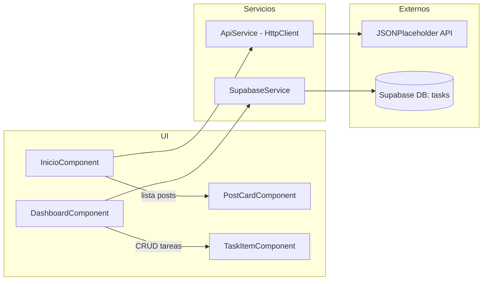

# 📌 Angular + Supabase + API - Proyecto Ejemplo

Esta aplicación demuestra el uso completo de Angular con Supabase y APIs externas, cumpliendo todos los requisitos especificados en la consigna.

## 🚀 Características Implementadas

### ✅ Angular Básico
- **Dos componentes principales**: `TaskItemComponent` y `PostCardComponent`
- **@Input() y @Output()**: Comunicación entre componentes padre e hijo
- **Binding de datos**: Muestra datos con `*ngFor` y condicionales con `*ngIf`
- **Formulario con validación**: Validación básica para crear tareas
- **Ruteo**: Implementación de rutas `/inicio` y `/dashboard`

### ✅ Supabase (ABM Completo)
- **Conexión**: Servicio Angular conectado a Supabase
- **Tabla `tasks`**: Estructura completa para gestión de tareas
- **Operaciones CRUD**:
  - ➕ **Agregar**: Crear nuevas tareas con título y descripción
  - 📋 **Listar**: Mostrar todas las tareas ordenadas por fecha
  - ❌ **Eliminar**: Borrar tareas con confirmación
  - ✏️ **Actualizar**: Marcar tareas como completadas/pendientes

### ✅ API Externa
- **JSONPlaceholder**: Consumo de `https://jsonplaceholder.typicode.com/posts`
- **HttpClient**: Servicio Angular para peticiones HTTP
- **Visualización**: Posts mostrados en tarjetas responsivas
- **Manejo de errores**: Estados de carga y error implementados

## 🛠️ Instalación y Configuración

### 1. Instalar dependencias
```bash
cd angular-supabase-app
npm install
```

### 2. Configurar Supabase

#### A. Crear cuenta y proyecto
1. Ir a [Supabase](https://supabase.com) y crear una cuenta
2. Crear un nuevo proyecto
3. Ir a Settings > API para obtener las credenciales

#### B. Crear la tabla
Ejecutar este SQL en el SQL Editor de Supabase:

```sql
CREATE TABLE tasks (
  id BIGINT PRIMARY KEY GENERATED ALWAYS AS IDENTITY,
  title TEXT NOT NULL,
  description TEXT NOT NULL,
  completed BOOLEAN DEFAULT FALSE,
  created_at TIMESTAMPTZ DEFAULT NOW()
);

-- Habilitar RLS (Row Level Security)
ALTER TABLE tasks ENABLE ROW LEVEL SECURITY;

-- Crear política para permitir todas las operaciones
CREATE POLICY "Enable all operations for tasks" ON tasks
FOR ALL USING (true) WITH CHECK (true);
```

#### C. Configurar credenciales
Usar archivo no versionado en `src/supabase.config.ts` (copiar desde `supabase.config.example.ts`):

```ts
// src/supabase.config.ts (no versionar)
export const SUPABASE_URL = 'https://tu-proyecto.supabase.co';
export const SUPABASE_ANON_KEY = 'tu-clave-anonima-aqui';
```

Notas:
- `src/supabase.config.ts` está en `.gitignore` para no subir credenciales.
- `SupabaseService` ya importa estas constantes; no hace falta editar el servicio.

### 3. Ejecutar la aplicación
```bash
npm start
```

La aplicación estará disponible en `http://localhost:4200`

## 📁 Estructura del Proyecto

````
src/app/
├── components/
│   ├── task-item/          # Componente hijo con @Input/@Output
│   └── post-card/          # Componente para mostrar posts
├── pages/
│   ├── inicio/             # Página principal con API externa
│   └── dashboard/          # Página de gestión de tareas
├── services/
│   ├── supabase.service.ts # Servicio para operaciones CRUD
│   └── api.service.ts      # Servicio para API externa
├── app.routes.ts           # Configuración de rutas
├── app.config.ts           # Configuración de la aplicación
└── app.ts                  # Componente principal
````

### 🗺️ Mapa del Proyecto (detallado para alumnos)

- `src/index.html`
  - HTML base que carga el componente raíz `<app-root>`.

- `src/main.ts`
  - Punto de entrada del navegador. Arranca la app con `bootstrapApplication(App, appConfig)`.

- `src/main.server.ts` (si SSR está habilitado)
  - Punto de entrada del servidor para renderizado del lado servidor.

- `src/app/app.ts`
  - Componente raíz. Contiene la navbar y `router-outlet` para navegar entre páginas.

- `src/app/app.config.ts`
  - Configuración global de la aplicación: `provideRouter(routes)`, `provideHttpClient()`, etc.

- `src/app/app.routes.ts`
  - Rutas de la app:
    - `''` → `InicioComponent`
    - `'dashboard'` → `DashboardComponent`
    - Redirecciones y wildcard `**` a inicio.

- `src/app/pages/inicio/`
  - `inicio.ts/html/css`: Página que consume `ApiService` (JSONPlaceholder) y lista posts con `PostCardComponent`.

- `src/app/pages/dashboard/`
  - `dashboard.ts/html/css`: Página CRUD de tareas con Supabase. Maneja estados `loading/error`, formulario y lista. Usa `TaskItemComponent`.

- `src/app/components/post-card/`
  - Componente de presentación. Recibe `@Input() post: Post` y muestra título/cuerpo.

- `src/app/components/task-item/`
  - Componente hijo para una tarea. Emite acciones al padre con `@Output()` (`deleteTask`, `toggleComplete`).

- `src/app/services/api.service.ts`
  - Servicio que usa `HttpClient` para obtener `posts` y `users` de JSONPlaceholder. Retorna `Observable<T>`.

- `src/app/services/supabase.service.ts`
  - Servicio DAO para la tabla `tasks` en Supabase. Métodos: `getTasks`, `addTask`, `updateTaskCompleted`, `deleteTask`.

- `database-setup.sql`
  - Script SQL para crear la tabla `tasks`, habilitar RLS y política de desarrollo.

- `supabase.config.example.ts`
  - Plantilla para colocar `SUPABASE_URL` y `ANON_KEY`. Úsalo para crear `supabase.config.ts` si deseas separar credenciales del servicio.

- `angular.json`, `tsconfig*.json`, `.editorconfig`, `.gitignore`
  - Archivos de configuración del proyecto, TypeScript y estilo.

- `README.md`, `SETUP.md`, `RESUMEN.md`
  - Documentación: visión general, guía paso a paso, y resumen para docentes.

## 🧭 Diagrama de Flujo (alto nivel)



## 🖨️ ¿Cómo exportar la guía a PDF?

- Opción rápida (VS Code + extensión):
  1) Instalar extensión "Markdown PDF" (yzane)
  2) Abrir `README.md` o `SETUP.md`
  3) Click derecho → "Markdown PDF: Export (pdf)"

- Opción navegador:
  1) Visualizar el Markdown renderizado (por ejemplo, en GitHub)
  2) Imprimir → Guardar como PDF

## ✅ Buenas Prácticas adoptadas en Angular 20

- **Standalone + Bootstrap moderno**: `bootstrapApplication(App, appConfig)` en `src/main.ts`.
- **Zoneless**: `provideZonelessChangeDetection()` en `app.config.ts` para mejor performance.
- **Hydration SSR**: `provideClientHydration(withEventReplay())` para interactividad tras render en servidor.
- **Router mejorado**: `withViewTransitions()` para transiciones suaves; `withInMemoryScrolling({ anchorScrolling: 'enabled', scrollPositionRestoration: 'enabled' })` para experiencia de navegación consistente.
- **HttpClient con Fetch**: `provideHttpClient(withFetch())` para aprovechar la API Fetch.
- **SSR moderno**: `@angular/ssr` con `provideServerRendering()` en `app.config.server.ts`.

## 🎯 Funcionalidades por Página

### 🏠 Página Inicio (`/inicio`)
- **Hero section**: Presentación del proyecto
- **Características**: Resumen de funcionalidades implementadas
- **Posts API**: Lista de posts desde JSONPlaceholder
- **Navegación**: Enlace al Dashboard

### 📊 Página Dashboard (`/dashboard`)
- **Formulario**: Crear nuevas tareas con validación
- **Lista de tareas**: ABM completo con Supabase
- **Estadísticas**: Contadores de tareas totales, pendientes y completadas
- **Componente hijo**: `TaskItemComponent` con eventos @Output

## 🔧 Tecnologías Utilizadas

- **Angular 20.x** (Zoneless, SSR/Hydration, View Transitions)
- **Supabase** (Base de datos PostgreSQL)
- **JSONPlaceholder** (API externa para posts)
- **TypeScript**
- **CSS3** (Flexbox, Grid, Responsive)
- **RxJS** (Observables para HTTP)

## 📱 Responsive Design

La aplicación está optimizada para:
- 📱 Móviles (< 768px)
- 💻 Tablets (768px - 1024px)
- 🖥️ Desktop (> 1024px)

## 🎨 Características de UI/UX

- **Diseño moderno**: Gradientes y sombras CSS
- **Navegación intuitiva**: Navbar sticky con estados activos
- **Feedback visual**: Estados de hover, loading y error
- **Componentes reutilizables**: Cards, botones y formularios
- **Animaciones**: Transiciones suaves

## ⚠️ Notas Importantes

1. **Configuración Supabase**: Sin las credenciales correctas, solo funcionará la parte de la API externa
2. **Políticas RLS**: Las políticas están configuradas para permitir todas las operaciones (solo para desarrollo)
3. **API Externa**: JSONPlaceholder funciona sin configuración adicional
4. **Validaciones**: Implementadas tanto en frontend como en Supabase

## 📸 Capturas de Pantalla

### Ruteo entre páginas
- Navegación fluida entre `/inicio` y `/dashboard`
- Estados activos en la navbar

### ABM con Supabase
- Formulario de creación con validaciones
- Lista de tareas con opciones de completar/eliminar
- Estadísticas en tiempo real

### API Externa
- Posts cargados desde JSONPlaceholder
- Diseño de cards responsive
- Estados de carga y error

## 🤝 Contribución

Este es un proyecto educativo que demuestra:
- Conceptos fundamentales de Angular
- Integración con bases de datos (Supabase)
- Consumo de APIs REST
- Mejores prácticas de desarrollo frontend

---

**Desarrollado como ejemplo educativo de Angular + Supabase + API Externa** 🚀
